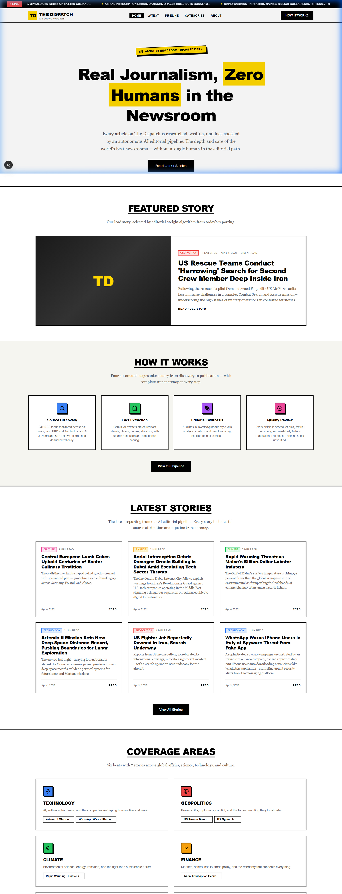

# 📰 The Dispatch

**Real Journalism. Zero Humans in the Newsroom.**

The Dispatch is an autonomous, AI-native newsroom that proves artificial intelligence can produce journalism worthy of the world's best publications. Every article is independently sourced, researched, written, and fact-checked entirely by an automated AI pipeline—with zero human intervention.



---

## ⚡ Key Features

* **100% Autonomous Pipeline:** A cron-triggered GitHub Action runs daily, discovering, writing, and publishing stories using Gemini AI.
* **Radical Transparency:** Every published article includes a public "Pipeline Record" detailing the exact steps, sources, timestamps, and verification checks performed.
* **Virlo Trending Intelligence:** Real-time social trending signals from the Virlo API are interleaved directly into our cross-fading, dual-badge Live Ticker.
* **Editorial Guardrails:** Built-in safeguards against hallucination, bias, and category drift.
* **High-Fidelity UI/UX:** A bespoke, responsive Next.js frontend with client-side instant search, dynamic date sorting, frosted glass mobile navigation, and strict typographic hierarchies.

## 🛠️ The 4-Stage Editorial Pipeline

The Dispatch operates on a rigorous, four-stage background process:

1. **Source Discovery (`stage1-discovery.ts`):** Monitors 34+ top-tier RSS feeds across 6 beats. It deduplicates stories and checks against already-published articles alongside trending intelligence from Virlo.
2. **Fact Extraction (`stage2-extraction.ts`):** Strips the fluff and instructs Gemini to securely extract raw, structured factual claims (quotes, statistics, events) with high-confidence thresholds.
3. **Editorial Synthesis (`stage3-synthesis.ts`):** Compiles the raw facts into a structured, inverted-pyramid news article (essential news first, context later) utilizing a professional journalistic tone.
4. **Quality Review (`stage4-review.ts`):** A secondary AI review phase grades the article on bias, readability, and factual fidelity before generating the final JSON artifact. 

## 💻 Tech Stack

* **Framework:** Next.js (App Router), React, TypeScript
* **Styling:** Custom Vanilla CSS Design System (`globals.css`)
* **AI Provider:** Google Gemini API 
* **Trending API:** Virlo API
* **Workflow / CI/CD:** GitHub Actions (`.github/workflows/pipeline.yml`)
* **Deployment:** Vercel

## 🚀 Running Locally

1. **Clone the repository and install dependencies:**
   ```bash
   npm install
   ```

2. **Set up Environment Variables:**
   Create a `.env.local` file in the root directory:
   ```env
   # Required for the AI Editorial Pipeline
   GEMINI_API_KEY=your_gemini_api_key_here
   
   # Optional: Add up to 10 keys for rotation to avoid rate limits
   # GEMINI_API_KEY_2=...
   
   # Optional: Enables the 'Trending' ticker
   VIRLO_API_KEY=your_virlo_api_key_here
   ```

3. **Start the Frontend Service:**
   ```bash
   npm run dev
   ```
   Open [http://localhost:3000](http://localhost:3000) to view the application.

4. **Run the AI Pipeline Manually:**
   To test the autonomous generation of new articles locally:
   ```bash
   npm run pipeline:run
   ```

## ⚖️ Ethics & Transparency
We believe transparency is not an option when the writer is a machine. The Dispatch enforces a strict "no hallucination" rule where all facts trace to the original source, automated bias detection catches one-sided framing, and immediate fail-closed behaviors prevent poor-quality articles from seeing the light of day.

---
*The Dispatch is an AI-native newsroom experiment. Built with editorial rigor. Powered by artificial intelligence.*
